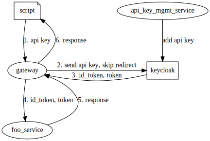

# API keys and keycloak

Here's one way to use API keys with services through keycloak

It's slightly different from the typical browser case as we don't want users to
have to manage sessions or tokens (and refreshing!).

Instead, we'll have a gateway manage the tokens for the user (script), which
acts as a User Agent.

To translate an API key to an access token, we will need a way of

1. Validating that the API key is valid (has been previously created and
   associated with a user and application)
2. Based on the API key, retrieve an access token and id token for a specific
   resource server

## API key management service

+ Will handle generating API keys and associating API keys with user, app into keycloak
  + One possible implementation would be to use "User Attributes" in keycloak
    and store it there
  + The format of this key would be the base64 encoded tuple of
    + (resource server, username, api key)
+ Will be authenticated/authorized by keycloak, obviously

## Gateway's roles

> Note: this gateway does not serve to authenticate users; it is not the same
>   gateway that checks for access token and if there's no access token,
>   redirect the user to keycloak. For this diagram, `foo_service` will have to
>   check and redirect to keycloak as necessary.

+ Proxy requests to upstream service(s) after getting access token
+ Use the implicit flow to exchange the API key for the access token and id token
+ Re-use the API Key to get new access token and id token if access token expires
+ May have to decode the API key into user and api key, depending on whether
  keycloak's authentication SPI can take a single key, without password

> Can the redirect part in the implicit flow be "skipped"?

## Keycloak's role

> Keycloak will need to be augmented to handle this

+ Decode the API key
+ Check that the api key tuple is valid (previously created and associated with
  a user and application)

## Alternatives

### Long-lived access tokens as API keys

+ Configure a long expiry for access tokens
+ For regular app access, request access tokens of shorter expiries
+ Have a special app that is able to request access tokens of longer expiries,
  and manage those

> I think the OAuth spec doesn't allow a client to specify expiry duration?
