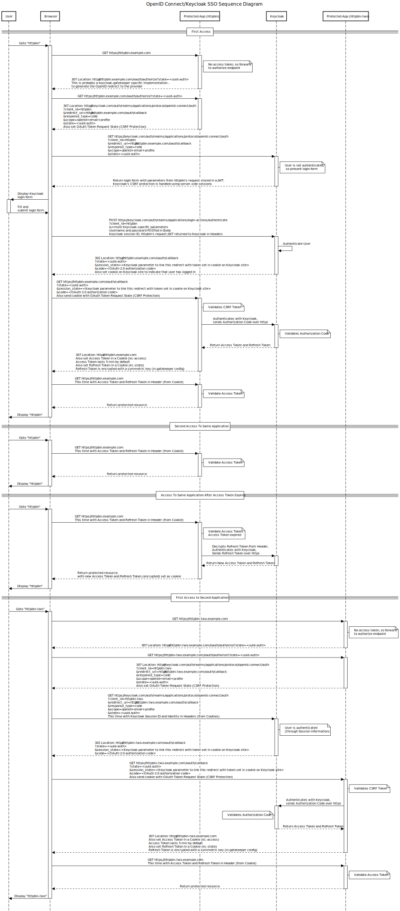

# Comparing CAS vs OAuth2 as implemented by Keycloak

This is really not an apples-to-apples comparison, since CAS is really focused
on web applications and SSO, while OAuth2 is a framework for authorization and
how it can be done in a decentralized way

## How it works in CAS

Refer to diagrams on the [CAS Docs](https://apereo.github.io/cas/development/protocol/CAS-Protocol.html)

### Web flow diagram

### Web flow diagram for Keycloak + Keycloak Gatekeeper + OAuth2

