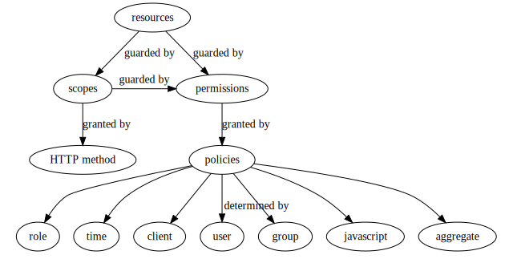

# Keycloak Authorization Services

## Relationship between Resources/Scopes/Permissions/Policies

Here's how they are related:

In addition:

+ Resource-to-scopes is one-to-many. All scopes have to be present before
  access to the resource is allowed.
+ Permissions can be decided based on many policies (one-to-many). Use
  `UNANIMOUS` if you want all the match or `AFFIRMATIVE` if you only need one
  to match before the scope/resource for this permission is granted
+ A permission can grant many scopes based on policy, but
+ A permission can only grant one resource based on policy, unless the resource
  type mechanism is used to grant access to all resources matching a resource
  type at once
